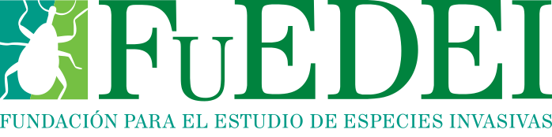
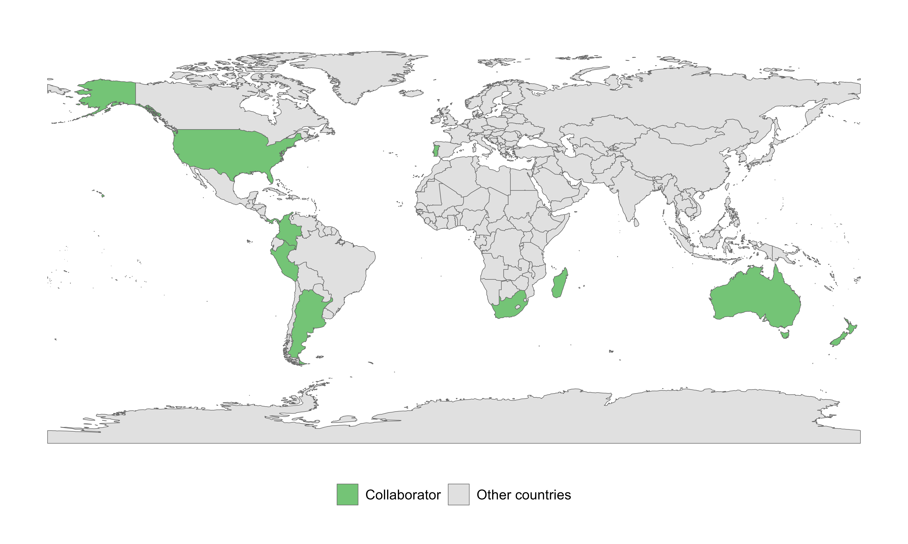

# Institutions

  
  
  

# Coordinators

- **Dr. Alejandro Sosa** - Fundación para el Estudio de Especies Invasivas (FuEDEI) & Consejo Nacional de Investigaciones Científicas y Técnicas (CONICET), Argentina.
- **Dr. Andrés F. Sánchez Restrepo** - Fundación para el Estudio de Especies Invasivas (FuEDEI) & Universidad de Buenos Aires (UBA), Argentina.
- **Megan Reid, PhD** - University of Florida Fort Lauderdale Research and Education Center, USA.
- **Melissa Smith, PhD** - Invasive Plant Research Laboratory (USDA), USA.
- **Prof. Julie Coetzee** - Deputy Director of the Centre for Biological Control at Rhodes University, South Africa.
- **Dr. Ana Faltlhauser** - Fundación para el Estudio de Especies Invasivas (FuEDEI) & Consejo Nacional de Investigaciones Científicas y Técnicas (CONICET), Argentina.
- **MSc. Miguel A. Caicedo Baltodano** - Fundación para el Estudio de Especies Invasivas (FuEDEI) & Consejo Nacional de Investigaciones Científicas y Técnicas (CONICET), Peru/Argentina.

# Collaborators

Our work is empowered by an international network of researchers and institutional partners across the globe.

### Global Collaboration Network
{fig-align="center" width="100%"}

### Collaborator List

- **Lynley Hayes** - Landcare Research, New Zealand.
- **Ben Gooden** - CSIRO Health & Biosecurity, Australia.
- **Tahina Ernest Rajaonera** - University of Antananarivo, Madagascar.
- **Hélia Marchante** - CERNAS / ESAC, Portugal.
- **Nathan Harms** - US Army Engineer Research and Development Center / USACE, USA.
- **Angélica Alejandra Palma Araúz** - Universidad Nacional de Colombia & Universidad de Panamá.
- **Diana Carolina López Álvarez** - National University of Colombia (UNAL), Colombia.
- **Héctor Aponte** - Universidad Científica del Sur, Peru.
- **Carey Minteer** - UF/IFAS, Indian River Research and Education Center, USA.