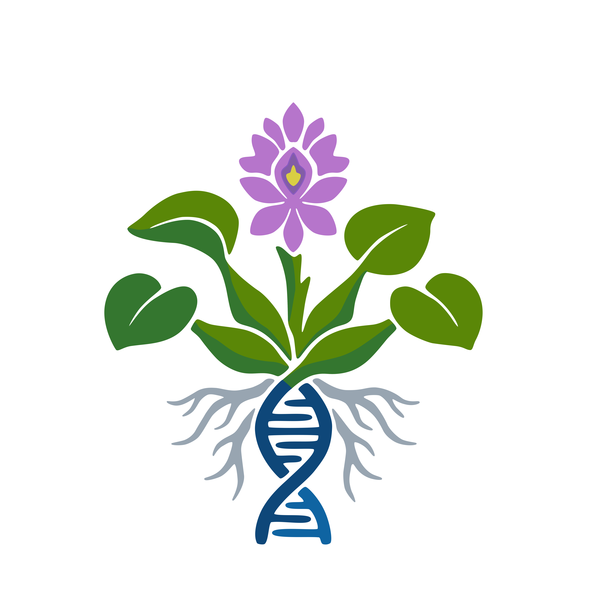

# Guides and Protocols

{fig-align="center" width="30%"}

Our laboratory uses standardized protocols for the collection, extraction, and quantification of nucleic acids, specifically optimized for water hyacinth (*Pontederia crassipes*).

---

## 🌿 1. Tissue Collection and Herborization

### Tissue Collection for DNA Extraction
For optimal DNA preservation, tissue must be dried using silica gel immediately after collection in the field.

{fig-align="center" width="80%"}

1. Select healthy, young leaves of *P. crassipes*.
2. Cut small pieces of the leaf, avoiding thick, highly hydrated spongy tissues if possible.
3. Place the tissue pieces in a zip-lock bag filled with color-indicating silica gel.
4. Allow to dry completely (the tissue should become brittle and snap when bent).

### Herborization and Voucher Specimens
A voucher specimen of each collected plant **must** be deposited in a recognized local herbarium. Additionally, high-quality photographs of the plant in its habitat and the pressed specimen must be archived by the collaborator.

{fig-align="center" width="40%"}

Follow the specific herbarium protocols of your local institution. If no specific guidelines for aquatic plants are provided by your local herbarium, use the following method adapted for aquatic flora (Rodríguez & Rojas, 2006):

* **Aquatic Plant Pressing:** Do not press directly into dry newspaper, as delicate aquatic parts (like *Pontederia* flowers) may adhere to the paper and be destroyed upon removal. 
* Collect the plants in wet newspaper and roll them up.
* In the laboratory/herbarium, place the plant in a tray of water to allow all parts to spread out and extend naturally.
* Slide a piece of white cardstock under the plant and carefully lift it out of the water, keeping the plant fixed to the cardstock.
* Place the cardstock with the plant inside the pressing paper (newspaper/blotters) and proceed with standard drying methods.

### Mandatory Sample Metadata
Regardless of the specific label requirements of the local herbarium for the voucher specimen, all collaborators **must** record and retain the following metadata for every collected sample. This information is critical for our global database. 

Please record the data using these exact fields:

| Field Name | Description & Examples |
| :--- | :--- |
| **code** | Unique sample identifier (e.g., CAM0001, M04) |
| **no_samples** | Number of samples collected (e.g., 1, 5) |
| **preservation** | Tissue preservation method (e.g., Dry leaf in silica, Fresh leaf) |
| **herbo** | Herbarium code where the voucher is deposited |
| **country** | Country of collection (e.g., Argentina, Mexico) |
| **stateProvince** | State, province, or major region (e.g., Buenos Aires) |
| **locality** | Specific collection site (e.g., Otamendi, Laguna San Vicente) |
| **decimalLatitude** | Latitude in decimal degrees (e.g., 12.020736) |
| **decimalLongitude** | Longitude in decimal degrees (e.g., -61.762672) |
| **elevation** | Elevation in meters above sea level |
| **waterBody** | Name or type of the water body |
| **Date (year/month/day)** | Year, Month, and Day of collection |
| **fieldNotes** | Any relevant observations about the plant or environment |
| **recordedBy** | Name of the collector (e.g., A. Faltlhauser, A. Sosa) |
| **scientificName** | *Pontederia crassipes* |
| **degreeOfEstablishment** | Status in the area (e.g., Native, Invasive) |

---

## 🧬 2. DNA Extraction

### DNeasy® Plant Pro Kit (QIAGEN) - Optimized for *P. crassipes*
This protocol has been specifically tested and validated in our laboratory for water hyacinth. While the specific brand or model of the disruption equipment is flexible, the reagent modifications and vortexing parameters are crucial due to the plant's high phytochemical content.

**Starting Material & Pre-treatment:**

- Start with silica-gel dried plant tissue.
- **Crucial step:** Just prior to disruption, freeze the tissue using liquid nitrogen. If liquid nitrogen is unavailable, place the tissue in a -20°C or -80°C freezer overnight (or according to standard DNA preservation protocols).

**Preparation and Homogenization:**

1. Transfer the frozen tissue to your disruption tubes.
2. **Lysis Buffer:** Add the lysis buffer. *(Note: The standard QIAGEN protocol uses 500 µl of Solution CD1. However, because P. crassipes is high in phenolic compounds, our in-house validated method requires adding **450 µl of Solution CD1 and 50 µl of Solution PS**).*
3. **Homogenization:** You may use any available disruption equipment in your laboratory (e.g., any brand of vortex with an adapter, bead beater, or tissue homogenizer). However, you must follow the established parameters to ensure complete pulverization: **Vortex at maximum speed (between 10–15) for 3 to 5 minutes**.

**Extraction Steps:**

4. Centrifuge the disruption tubes at 12,000 x g for 2 min.
5. Transfer the supernatant to a clean 1.5 ml tube.
6. Add 200 µl of Solution CD2 and vortex for 5 s.
7. Centrifuge at 12,000 x g for 1 min. Avoiding the pellet, transfer the supernatant to a clean 1.5 ml tube.
8. Add 500 µl of Buffer APP and vortex for 5 s.
9. Load 600 µl of lysate onto an MB Spin Column. Centrifuge at 12,000 x g for 1 min. Discard the flow-through (repeat if necessary to process all lysate).
10. Place the column into a clean 2 ml collection tube. Add 650 µl of Buffer AW1, centrifuge at 12,000 x g for 1 min, and discard the flow-through.
11. Add 650 µl of Buffer AW2, centrifuge at 12,000 x g for 1 min, and discard the flow-through.
12. Centrifuge the column at up to 16,000 x g for 2 min to completely dry the membrane.
13. **Elution:** Add 50–100 µl of Buffer EB directly to the center of the membrane, let it sit briefly at room temperature, then centrifuge at 12,000 x g for 1 min.

---

## 💧 3. DNA Quantification & Quality Control

Collaborators may use any spectrophotometer or fluorometer available in their facilities. However, due to the high concentration of secondary metabolites in *P. crassipes*, we require specific criteria for determining quality and quantity.

### Quality Assessment: Spectrophotometry (e.g., NanoDrop)
Spectrophotometers measure absorbance and are highly susceptible to interference from phytochemicals, carbohydrates, and phenols common in water hyacinth. Therefore, this method should be used **strictly to assess DNA quality**, not absolute quantity.

* **A260/280 Ratio (Protein contamination):** The accepted range for pure DNA is **~1.8 to 2.0**.
* **A260/230 Ratio (Carbohydrate/Phenol contamination):** The ideal accepted range is **1.8 – 2.2**. In plants with high secondary metabolites, this value is often lower, but values significantly < 1.5 indicate contamination that may inhibit downstream PCR or NGS applications (Desjardins et al., 2009).

### Quantity Assessment: Fluorometry (e.g., Qubit, DeNovix FX)
For accurate yield determination, fluorometric methods are required. Fluorometers use intercalating dyes that bind specifically to double-stranded DNA (dsDNA), bypassing the absorbance interference caused by plant secondary metabolites. 

* Always report the final DNA concentration (ng/µl) based on **fluorometric readings** to ensure an accurate input calculation for genomic sequencing.